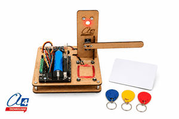

# A4 microSySTEM-Barrier



MakeCode extension for the **A4 Technologie microSySTEM-Barrier** educational model.

The microSySTEM-Barrier reproduces the operation of an automated access barrier such as those used at car parks and toll gates. It is controlled by a **BBC micro:bit** and a **DFR1216 expansion board**.

The model allows students to work with a complete automated system combining identification, vehicle detection, visual signalling and mechanical movement.

## Product and educational use

The model is designed for technology and computer science education. It can be used to study:

- automated systems;
- information and energy chains;
- RFID identification and access control;
- sensors and actuators;
- conditional programming;
- state-based control sequences;
- safety logic for an automated barrier.

Product page:  
https://www.a4.fr/barrier-maquette-programmable-microsystem-pour-micro-bit.html

Manufacturer:  
https://www.a4.fr

## Hardware

The microSySTEM-Barrier model uses:

- **BBC micro:bit** – program execution and user interface;
- **DFR1216 expansion board** – connection and power interface;
- **RFID reader** – reads cards and tags used for access control;
- **IR proximity sensor** – detects the vehicle passing through the barrier;
- **servomotor** – opens and closes the barrier arm;
- **RGB LED** – provides red/green visual signalling.

### Connections used by the extension

| Component | Connection |
|---|---|
| RFID reader | UART – P14 / P15 |
| RGB LED | P0 |
| Barrier servomotor | S0 |
| IR proximity sensor | C0 |

## Add the extension in MakeCode

1. Open the [MakeCode editor for micro:bit](https://makecode.microbit.org/).
2. Create or open a project.
3. Select **Extensions**.
4. Paste the following repository URL into the search field:

```text
https://github.com/A4-TECHNOLOGIE/a4-microSySTEM-Barrier
```

5. Select **A4 microSySTEM Barrier**.

A new block category is added to the MakeCode toolbox.

## Blocks / API

### Read RFID tag

```typescript
a4_microSySTEM_Barrier.readID()
```

Reads the RFID reader and returns the numerical identifier of the detected tag or card. The function returns `0` when no valid new RFID identifier is available.

### Set the signalling light to a predefined color

```typescript
a4_microSySTEM_Barrier.setRingColor(a4_microSySTEM_Barrier.Colors.Green)
```

Sets the RGB signalling LED to one of the predefined colors:

- red;
- green;
- blue;
- white;
- black (off).

### Turn off the signalling light

```typescript
a4_microSySTEM_Barrier.lightsOFF()
```

Turns the RGB signalling LED off.

### Set a custom RGB color

```typescript
a4_microSySTEM_Barrier.rgb(255, 100, 0)
```

Sets the signalling LED using red, green and blue values from `0` to `255`.

### Set the servomotor angle

```typescript
a4_microSySTEM_Barrier.setServoAngle(90)
```

Sets the barrier servomotor angle between `0°` and `180°`.

### Open or close the barrier

```typescript
a4_microSySTEM_Barrier.barrier(a4_microSySTEM_Barrier.Action.open)
a4_microSySTEM_Barrier.barrier(a4_microSySTEM_Barrier.Action.close)
```

Moves the servomotor directly to the predefined open or closed position of the microSySTEM-Barrier model.

### Detect a vehicle

```typescript
a4_microSySTEM_Barrier.presenceSensor()
```

Returns `true` when the IR proximity sensor detects a vehicle or object and `false` otherwise.

## Example: automated access barrier

The following example authorizes a set of RFID identifiers. When an authorized badge is read, the light turns green and the barrier opens. As soon as the vehicle is detected, the light turns red to prevent a second vehicle from entering. The barrier closes only after the vehicle has completely passed the proximity sensor.

```typescript
let badge = 0
let id = 0

let authorizedRFID = [
    2608171,
    6947423,
    2540442,
    3202542,
    9679242
]

a4_microSySTEM_Barrier.barrier(
    a4_microSySTEM_Barrier.Action.close
)

a4_microSySTEM_Barrier.setRingColor(
    a4_microSySTEM_Barrier.Colors.Red
)

basic.forever(function () {
    badge = a4_microSySTEM_Barrier.readID()

    if (badge != 0) {
        id = authorizedRFID.indexOf(badge)

        if (id >= 0) {
            basic.showIcon(IconNames.Yes)

            a4_microSySTEM_Barrier.setRingColor(
                a4_microSySTEM_Barrier.Colors.Green
            )

            a4_microSySTEM_Barrier.barrier(
                a4_microSySTEM_Barrier.Action.open
            )

            while (!(a4_microSySTEM_Barrier.presenceSensor())) {
                basic.pause(50)
            }

            a4_microSySTEM_Barrier.setRingColor(
                a4_microSySTEM_Barrier.Colors.Red
            )

            while (a4_microSySTEM_Barrier.presenceSensor()) {
                basic.pause(50)
            }

            basic.pause(500)

            a4_microSySTEM_Barrier.barrier(
                a4_microSySTEM_Barrier.Action.close
            )
        } else {
            basic.showIcon(IconNames.No)
            a4_microSySTEM_Barrier.setRingColor(
                a4_microSySTEM_Barrier.Colors.Red
            )
        }
    }

    basic.pause(50)
})
```

> Replace the RFID identifiers in `authorizedRFID` with the identifiers of the cards or tags used with your model.

## Artificial intelligence extension

The microSySTEM-Barrier can also be associated with the **microSySTEM-AI Vision** model. Visual recognition can then complement or replace RFID identification, for example to experiment with OCR-based identification or vehicle recognition before opening the barrier.

## License

This extension is released under the **MIT License**. See [LICENSE.txt](LICENSE.txt).

## A4 Technologie

Designed for educational use by **A4 Technologie**.  
https://www.a4.fr

---

for PXT/microbit
